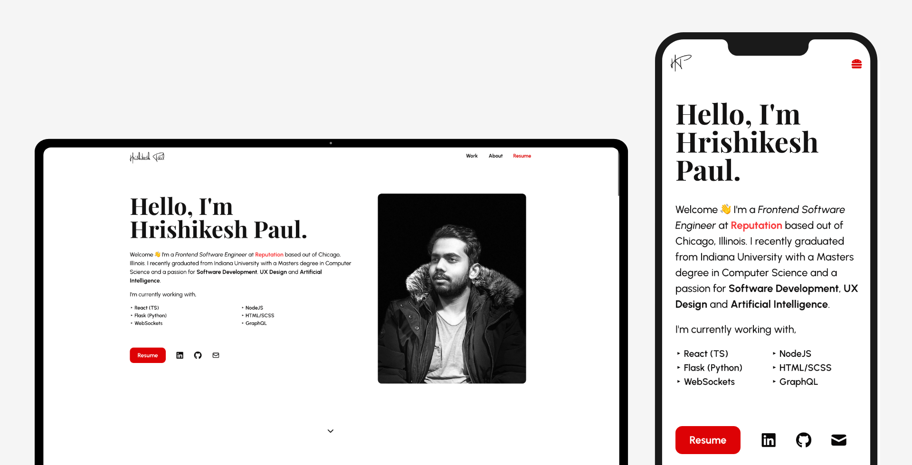

# Portfolio Template 🖐
> Version 2 of a simple, minimal and responsive personal website template, built using React, TypeScript, HTML, and SCSS.



💻  Live [demo](https://utkarshgogna1.github.io/portfolio-template-v2/)

---

## Table of Contents

- [Installation](#installation)
- [Usage](#usage)
- [Contributing](#contributing)
- [Connect](#connect)
- [License](#license)

---

## Installation

### Setup 

Clone repository

```shell
$ git clone https://github.com/utkarshgogna1/portfolio-template-v2.git

> To install the node packages used in the project:
$ cd portfolio-template-v2
$ yarn install
> Compiles and hot-reloads for development:
$ yarn start
> Compiles and minifies for production:
$ yarn build

Usage
All the information can be edited in the JSONs and Markdowns in the content folder. Each section of the portfolio has its own folder. The common.json file contains details that are used throughout the website.

All the images are in public/assets.

Contributing
Clone this repo to your local machine.
Checkout to a new branch. Give it a relevant name!
Create a pull request.
Connect
Website at <a href="https://utkarshgogna1.github.io/" target="_blank">https://utkarshgogna1.github.io/</a>
LinkedIn at <a href="https://www.linkedin.com/in/utkarshgogna1/" target="_blank">utkarshgogna1</a>
License

MIT license
Copyright 2022 © <a href="https://utkarshgogna1.github.io/" target="_blank">Utkarsh Gogna</a>

### Summary of Changes:
1. Updated repository links to `https://github.com/utkarshgogna1/portfolio-template-v2`.
2.
3. Updated the website and LinkedIn links to reflect your profile (`utkarshgogna1`).
4. Updated copyright details to "Utkarsh Gogna".

Let me know if you need further modifications or if you'd like assistance with anything else!


